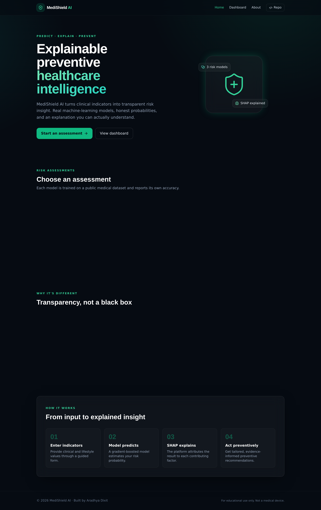
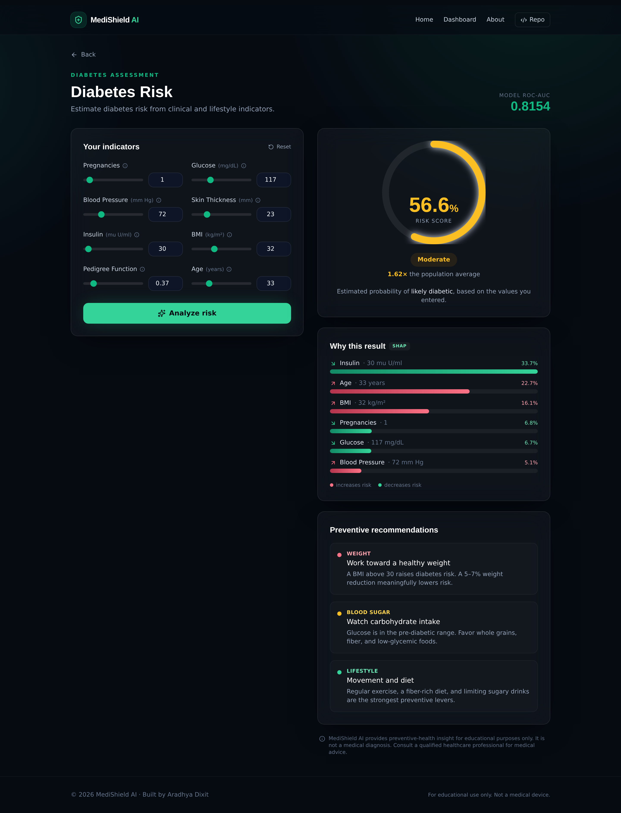

# 🏥 MediShield AI

### Explainable Preventive Healthcare Intelligence Platform

**Predict · Explain · Prevent**

MediShield AI turns clinical indicators into transparent disease-risk insight. It runs real
machine-learning models for **diabetes, heart disease, and stroke**, explains every prediction with
**SHAP** so nothing is a black box, and returns **personalized preventive recommendations** — all
behind a polished React interface.



---

## ✨ Features

- **Three risk models** — diabetes, heart disease, and stroke, each a gradient-boosted (XGBoost) model trained on a public medical dataset.
- **Explainable by design** — every prediction ships with SHAP attributions showing which factors drove the result and by how much.
- **Personalized recommendations** — evidence-informed preventive guidance mapped to your specific risk drivers (no API key required).
- **Health dashboard** — every assessment is tracked locally with a risk-over-time chart.
- **Honest metrics** — each model reports its own out-of-sample ROC-AUC, and no result is presented as a diagnosis.
- **Modern UI** — React + TypeScript + Tailwind + Framer Motion, with an animated risk gauge and SHAP explanation charts.

| Model | ROC-AUC | Accuracy | Samples |
|-------|:-------:|:--------:|:-------:|
| Diabetes (Pima) | 0.82 | 0.75 | 768 |
| Heart Disease (UCI Cleveland) | 0.89 | 0.82 | 303 |
| Stroke (Kaggle) | 0.82 | 0.88 | 5,110 |



---

## 🏗️ Architecture

```
Browser (React SPA, Netlify)
        │  HTTPS / JSON
        ▼
FastAPI backend (Render / Docker)
        │
        ├── Model registry  → XGBoost models (per disease)
        ├── SHAP explainer  → per-factor attribution
        └── Recommendation engine (rule-based)
```

The frontend is a static SPA deployed to **Netlify**. The backend is a **FastAPI** service (with the
trained models and SHAP) deployed to a Python host such as **Render** or **Hugging Face Spaces**. The
two talk over a simple JSON API.

---

## 📁 Project structure

```
MediShield-AI/
├── backend/                 FastAPI service
│   ├── app/
│   │   ├── api/routes.py     REST endpoints
│   │   ├── core/config.py    settings + CORS
│   │   ├── services/         features, model registry, predict, recommend
│   │   ├── schemas/          Pydantic models
│   │   ├── artifacts/        trained models + metadata (committed)
│   │   └── main.py           app entrypoint
│   ├── tests/                pytest API tests
│   ├── Dockerfile
│   └── requirements.txt
├── frontend-web/            React + Vite + Tailwind SPA
│   ├── src/
│   │   ├── components/       RiskGauge, FactorChart
│   │   ├── pages/            Home, Assess, Dashboard, About
│   │   └── lib/              api client + UI helpers
│   ├── netlify.toml
│   └── Dockerfile
├── ml/                      dataset fetch + model training
│   ├── training/train.py    trains all three models
│   └── data/                datasets
├── docker-compose.yml       run the whole stack locally
└── render.yaml              one-click backend deploy
```

---

## 🚀 Quick start

### Option 1 — Docker (whole stack)

```bash
docker compose up --build
# Frontend → http://localhost:4173
# Backend  → http://localhost:8010
```

### Option 2 — Run locally

**Backend**
```bash
cd backend
python -m venv .venv && source .venv/bin/activate   # Windows: .venv\Scripts\activate
pip install -r requirements.txt
uvicorn app.main:app --reload --port 8010
```

**Frontend** (new terminal)
```bash
cd frontend-web
npm install
npm run dev        # http://localhost:5173
```

The frontend defaults to the backend at `http://127.0.0.1:8010`. Override with `VITE_API_URL`.

### Retrain the models (optional)

```bash
pip install -r backend/requirements.txt
python ml/training/train.py     # writes backend/app/artifacts/
```

---

## 🌐 Deployment

**Frontend → Netlify**
1. New site from Git → pick this repo.
2. Base directory: `frontend-web` · Build command: `npm run build` · Publish: `dist`.
3. Environment variable: `VITE_API_URL` = your backend URL.

**Backend → Render** (free)
1. New → Blueprint → select this repo (uses `render.yaml`), or New → Web Service → Docker, root `backend`.
2. Once live, set the frontend's `VITE_API_URL` to the Render URL and redeploy the frontend.
3. Optionally set `CORS_ORIGINS` to your Netlify URL.

---

## 🔌 API

| Method | Endpoint | Description |
|--------|----------|-------------|
| `GET`  | `/api/diseases` | List models and their metrics |
| `GET`  | `/api/diseases/{disease}/schema` | Form fields + metrics for one disease |
| `POST` | `/api/predict/{disease}` | Risk score + SHAP explanation + recommendations |
| `GET`  | `/health` | Health check |

```bash
curl -X POST http://localhost:8010/api/predict/diabetes \
  -H 'Content-Type: application/json' \
  -d '{"features":{"Pregnancies":6,"Glucose":190,"BloodPressure":92,"SkinThickness":35,"Insulin":250,"BMI":38.5,"DiabetesPedigreeFunction":0.9,"Age":54}}'
```

Interactive API docs are served at `/docs`.

---

## 🗺️ Roadmap

Phase 1 (this release): risk prediction, SHAP explainability, recommendations, dashboard, UI.
Phase 2: AI symptom checker, medical-report OCR analysis, and a RAG copilot grounded in WHO/CDC/NIH
sources (requires an LLM API key — set `LLM_API_KEY`).

---

## ⚠️ Medical disclaimer

MediShield AI is for educational and preventive-awareness purposes only. It does not provide a medical
diagnosis and is not a substitute for professional medical advice. Always consult a qualified
healthcare provider.

---

Built by **Aradhya Dixit** · [GitHub](https://github.com/AradhyaDixit18/MediShield-AI)
